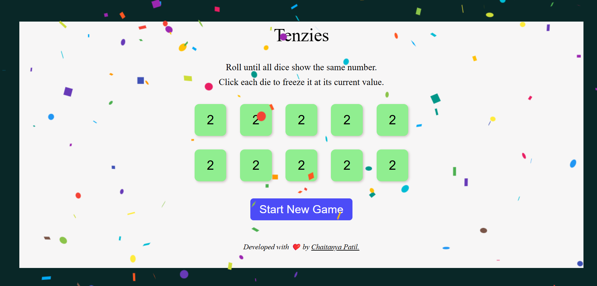

# Tenzies Game

Tenzies is a fun and interactive dice game where the goal is to roll all the dice until they show the same number. Players can freeze specific dice at their current value to strategize and win the game. The game is built using React with Vite and is deployed for online play.

## Features
- Roll dice to get matching numbers.
- Click on a die to freeze its value.
- Simple and intuitive user interface.
- Responsive design for seamless play on different devices.

## Built With
- **React** - A JavaScript library for building user interfaces.
- **Vite** - A fast frontend build tool.
- **CSS** - For styling the game interface.

## Deployment
The game is deployed and accessible online:
[Live Demo](https://tenzies-tan.vercel.app/)

## How to Run Locally
1. **Clone the repository**
   ```bash
   git clone <repository-url>
   ```
2. **Navigate to the project directory**
   ```bash
   cd tenzies-game
   ```
3. **Install dependencies**
   ```bash
   npm install
   ```
4. **Start the development server**
   ```bash
   npm run dev
   ```
5. Open your browser and navigate to `http://localhost:5173` to play the game locally.

## Screenshots


## Contributing
If you'd like to contribute to the project, feel free to open an issue or submit a pull request. Contributions are welcome!

## License
This project is licensed under the MIT License. Feel free to use and modify the code as needed.

---
Developed with ❤️ by [Chaitanya Patil](https://github.com/your-profile).

